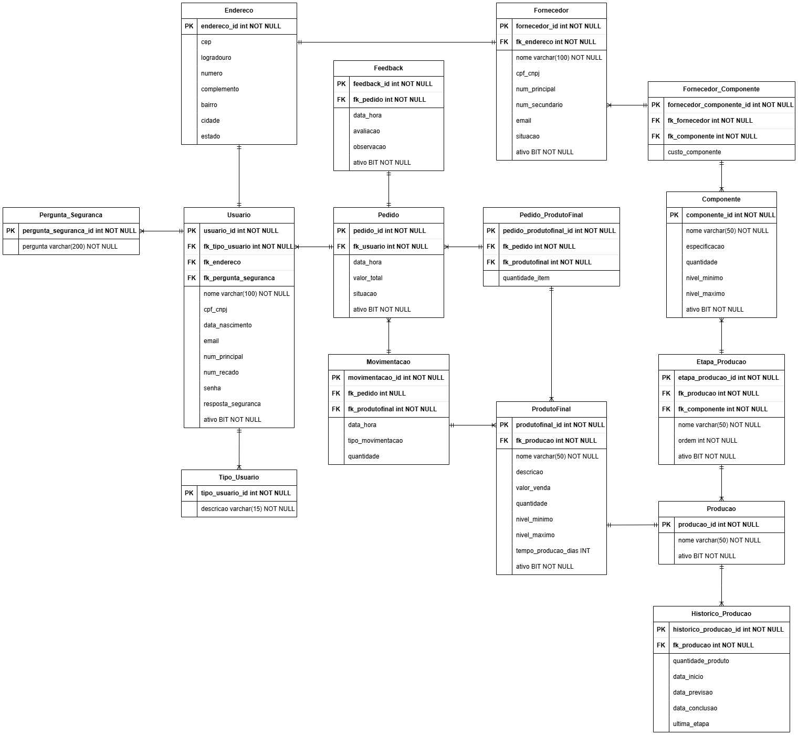

# TechSmart – Sistema de Gestão de Empresa de Montagem de Eletrônicos

## 🏢 Contextualização

A TechSmart é uma empresa consolidada no setor de eletrônicos de consumo, com **15 anos de atuação no mercado**. Com o objetivo de **expandir suas operações e aumentar sua capacidade de produção**, identificou-se a necessidade de uma solução de software de gestão personalizada para enfrentar os principais desafios enfrentados atualmente.

---

## ❗ Problemas Identificados

- **Gestão da Cadeia de Suprimentos:**
  - Cerca de **20% dos pedidos de componentes** sofrem atrasos ou são entregues com erros.
  - Isso impacta em um **aumento médio de 10% nos custos de produção**.

- **Controle de Qualidade:**
  - **Taxa de defeitos** dos produtos é de aproximadamente **5%**.
  - O **retrabalho e substituição** representam cerca de **8% do custo de produção**.

- **Baixa Eficiência na Montagem:**
  - A linha de produção opera em **75% da sua capacidade ideal**.

- **Satisfação do Cliente:**
  - **30% das entregas atrasam** ou apresentam produtos com defeito, gerando **reclamações e devoluções**.

---

## ✅ Requisitos Funcionais

- Cadastros de: **Produtos**, **Clientes**, **Linhas e Etapas de Produção**, **Fornecedores** e **Componentes**;
- Registro de **consumo de componentes por item de pedido**;
- **Movimentação de estoque** (entrada e saída) com **alertas de mínimo e máximo**;
- Relatórios de **previsão de demanda futura** com base no histórico;
- Relatórios em tempo real sobre **produtos semiacabados vs acabados**;
- **Relatório de feedbacks** dos clientes por pedido.

---

## 🔐 Segurança e Acesso

- 🔒 **Autenticação** com **pergunta e resposta de segurança**;
- 🔐 **Controle de acesso** baseado em **permissões e tipo de usuário**;
- 🔑 **Criptografia de dados sensíveis**;
- 🗑️ **Exclusão de usuários** com desvinculação de dados pessoais conforme a **LGPD**.

---

## 💻 Tecnologias Utilizadas

| Camada | Tecnologias |
|--------|-------------|
| Front-End | HTML5, CSS3, JavaScript |
| Back-End | PHP 8.2 |
| Banco de Dados | Microsoft SQL Server |

---

## 📦 Bibliotecas e Ferramentas

- **Bootstrap 5.3** – Estilização responsiva e moderna.
- **DataTables** – Tabelas interativas com busca, filtros, ordenação e exportação (Excel, PDF, etc).
- **Chart.js** – Geração de gráficos dinâmicos e responsivos.
- **Select2** – Customização de campos de seleção com suporte a busca.
- **Microsoft ODBC Driver for SQL Server** – Comunicação com banco SQL Server.
- **Microsoft SQLSRV (PHP Driver)** – Driver oficial para conexão PHP ⇄ SQL Server.

---

## 📁 Estrutura de Pastas do Projeto
```plaintext
techsmart_PHP/
├── _doc/                        → Documentação do projeto.
│   ├── Diagramas/               → Diagramas da arquitetura e banco de dados.
│   └── Script_SQL/              → Scripts de criação e inserção no banco de dados SQL Server.
│
├── back/                        → Código backend em PHP (includes gerais: login, sessões, validações, controladores).
│   └── api/                     → Endpoints específicos para fornecer dados via JSON.
│
├── front/                       → Código da interface e interação com o usuário.
│   ├── Pages/                   → Telas internas organizadas por funcionalidades (versão passada).
│   ├── css/                     → Arquivos CSS personalizados (temas, layouts).
│   ├── data/                    → Arquivos auxiliares como traduções e configurações do DataTables.
│   ├── dashboard/               → Gráficos, relatórios e dashboards organizados por categoria.
│   └── scr/                     → Scripts JavaScript personalizados (ex: janelas modais).
│
├── imgs/                        → Imagens e vídeos usados na interface do sistema.
│
└── index.html                   → Página de entrada principal do sistema (pode redirecionar ao login).
```


---

## 🗺️ Diagrama do Banco de Dados

> 

---

## 🚀 Objetivo Final

Este sistema visa **aumentar a eficiência operacional, reduzir erros, garantir rastreabilidade e melhorar a satisfação do cliente**, sendo um passo essencial para a transformação digital da empresa.

---

## 👨‍💻 Desenvolvido por

**TechSmart Dev Team – 2025**
- Amanda Caetano Nasser;
- Gustavo Henrique Nunes;
- José R. Gressoni Jr;
- Khalyl Enzo Ferron Vaz;
- Leonardo Tetsuo Minamida;
- Matheus Nassif do Nascimento;
- Mirian G. S. Rampanelli;
- Victor Galdino Batista da Silva.
